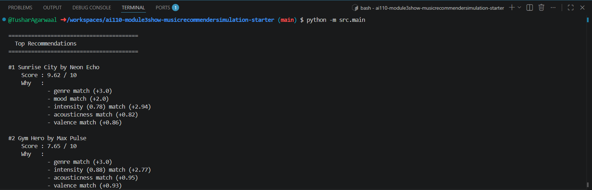
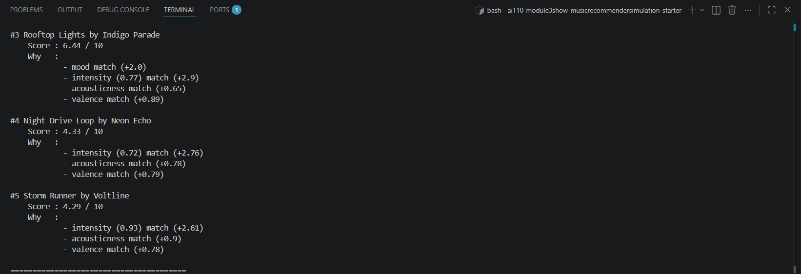

# 🎵 Music Recommender Simulation

## Project Summary

In this project you will build and explain a small music recommender system.

Your goal is to:

- Represent songs and a user "taste profile" as data
- Design a scoring rule that turns that data into recommendations
- Evaluate what your system gets right and wrong
- Reflect on how this mirrors real world AI recommenders

Replace this paragraph with your own summary of what your version does.

---

## How The System Works

Explain your design in plain language.

Some prompts to answer:

- What features does each `Song` use in your system
  - For example: genre, mood, energy, tempo
- What information does your `UserProfile` store
- How does your `Recommender` compute a score for each song
- How do you choose which songs to recommend

You can include a simple diagram or bullet list if helpful.

--- Below is the simple flow chart of how the program is processing:
Input (User Prefs) → Process (Recommender: Using the Algorithm recipe) → Output (The Ranking of Songs: Top K Recommendations).

The Algorithm Recipe is that it first calculates the score based on the intensity & genre which computes energy. But since this will only recommend songs based on score computed, it may not consider user's taste. Hence bpm is also taken in consideration to have better results which aligns with the user's taste as well.

genre, mood, energy, tempo_bpm, valence, acousticness and danceability are the features in the song but only energy & tempo_bpm are combined in the score.

UserProfile takes favorite_genre, favorite_mood, target_energy, target_bpm, and likes_acoustic, accounting for both taste and score.

Recommender compute the score based on the intensity score (energy and tempo) and genre/mood, which generates a weighted sum that ranks the songs.


---

## Getting Started

### Setup

1. Create a virtual environment (optional but recommended):

   ```bash
   python -m venv .venv
   source .venv/bin/activate      # Mac or Linux
   .venv\Scripts\activate         # Windows

2. Install dependencies

```bash
pip install -r requirements.txt
```

3. Run the app:

```bash
python -m src.main
```



### Running Tests

Run the starter tests with:

```bash
pytest
```

You can add more tests in `tests/test_recommender.py`.

---

## Experiments You Tried

Use this section to document the experiments you ran. For example:

- What happened when you changed the weight on genre from 2.0 to 0.5.
--- Rankings changed:

High-Energy Pop — Rooftop Lights jumped to #2, pushing Gym Hero to #3. Before, Gym Hero had genre match to carry it. Now intensity closeness matters more, and Rooftop Lights is closer in intensity to the user target.
Chill Lofi — Spacewalk Thoughts (ambient, not lofi) jumped to #3, overtaking Focus Flow (lofi). Genre now worth less, so intensity proximity carries it higher.
Scores exceeded 10 (e.g. 11.20) — expected since max is now 11.5 with the shifted weights.

Rankings stayed the same:

#1 picks (Sunrise City, Library Rain, Storm Runner) didn't change — they had both strong genre/mood AND strong intensity, so doubling intensity still keeps them on top.
This confirms the model is sensitive to weight changes but not fragile — top picks hold when they're genuinely strong across multiple features.


- What happened when you added tempo or valence to the score
--- Rankings are stable at the top and bottom (within bottom 3) except for the middle rankings. But scores exceeded 10 (max is now 12 with tempo+valence additions).

What shifted:
Gym Hero stays #2 for High-Energy Pop but scores jump from 7.65 → 9.62 — its high valence (0.93) and close tempo (132 bpm vs target 128) now contribute more.
Rooftop Lights stays #3 but gap to Gym Hero widened — it's an indie pop song with bpm 124, close enough in tempo to score well.
Songs with valence near 0.7 benefit most from the valence bump.

This shows that the model is sensitive in the middle ranks when I applied the score change.

- How did your system behave for different types of users
--- I added different types of users to the model and below are the observations:
The Gym Goer — max score only 6.63. No genre match drags the ceiling down significantly. Mood (intense) is the only categorical hit, so intensity carries the ranking. Gym Hero and Storm Runner trade #1/#2 closely (6.63 vs 6.59).

The Late Night Studier — strongest result at 9.57. Genre (lofi) + mood (focused) + close intensity all align on Focus Flow. The model works best when all signals point the same direction.

The Mood Listener — genre set to unknown so no genre points ever awarded. Sunrise City and Rooftop Lights top purely on mood match + intensity proximity. Max score 6.03 — confirms genre is worth +3.0 and its absence is felt.

The Genre Purist — only Coffee Shop Stories matches jazz in the whole catalog, so it scores 6.81 and #2 drops sharply to 4.10. Confirms genre match is a strong but sparse signal.

The Neutral User — no categorical matches at all, scores bunched tightly between 3.32–4.10. The model still differentiates but with low confidence — intensity + acousticness are the only separators.

When the Genre doesn't match, the max score drops to ~6.6, which results in tighter rankings and less decisive.

---

## Limitations and Risks

Summarize some limitations of your recommender.

Examples:

- It only works on a tiny catalog
- It does not understand lyrics or language
- It might over favor one genre or mood

You will go deeper on this in your model card.

The major limitation of the recommender is that it shows a bit inaccuracy since there are no mid-range intensity level songs in the pre-exisiting catalogue.

---

## Reflection

Read and complete `model_card.md`:

[**Model Card**](model_card.md)

Write 1 to 2 paragraphs here about what you learned:

- about how recommenders turn data into predictions
- about where bias or unfairness could show up in systems like this


---

## 7. `model_card_template.md`

Combines reflection and model card framing from the Module 3 guidance. :contentReference[oaicite:2]{index=2}  

```markdown
# 🎧 Model Card - Music Recommender Simulation

## 1. Model Name

Give your recommender a name, for example:

> VibeFinder 1.0

--- BeatHive 1.0

---

## 2. Intended Use

- What is this system trying to do
- Who is it for

Example:

> This model suggests 3 to 5 songs from a small catalog based on a user's preferred genre, mood, and energy level. It is for classroom exploration only, not for real users.

--- The model calculates the score from the song catalog based on its 5 components, returning a sorted list of songs defined by user's preference.
It is for classroom exploration only, not for real users.
---

## 3. How It Works (Short Explanation)

Describe your scoring logic in plain language.

- What features of each song does it consider
- What information about the user does it use
- How does it turn those into a number

Try to avoid code in this section, treat it like an explanation to a non programmer.

--- It considers 5 features of a song: Genre, Mood, Intensity, Acousticness and Valence. User preference including target energy level and target bpm are taken into consideration, which combine as intensity level & contributes maximum out of all the features to the scoring.
Certain points are assigned to each feature and they are applied in a logical formula, which then helps in ranking the song.

---

## 4. Data

Describe your dataset.

- How many songs are in `data/songs.csv`
- Did you add or remove any songs
- What kinds of genres or moods are represented
- Whose taste does this data mostly reflect


--- There are 10 songs in the csv file and no songs were added or deleted from the catalog.
Six types of Genre and 5 types of Mood are taken into consideration by the recommender.
User's preference includes Genre and Mood whose taste gets reflected.

---

## 5. Strengths

Where does your recommender work well

You can think about:
- Situations where the top results "felt right"
- Particular user profiles it served well
- Simplicity or transparency benefits

---The user profiles that have clear details on the preference gets better recommendations.
High-Energy Pop, Chill Lofi, and Deep Intense Rock were some of the user profiles where it worked the best.
The lofi profiles: Library Rain and Midnight Coding are both low-intensity, acoustic, chill, where the scores reflect that with very little ambiguity.

---

## 6. Limitations and Bias

Where does your recommender struggle

Some prompts:
- Does it ignore some genres or moods
- Does it treat all users as if they have the same taste shape
- Is it biased toward high energy or one genre by default
- How could this be unfair if used in a real product

---There are 10 songs in the .csv file, and checking by their intensity values, no one accurately covers the user's preferred intensity.
The medium-intensity user is systematically penalized 0.4 points on intensity before the scoring even looks at genre or mood.
For ultra-high intensity users, user can't have 1.0 intensity song as per the current song catalogue, setting the one preference.
The formula set for calculating score treats overshooting and undershooting equally because of the gap size between intensity of different songs in the current catalogue.

---

## 7. Evaluation

How did you check your system

Examples:
- You tried multiple user profiles and wrote down whether the results matched your expectations
- You compared your simulation to what a real app like Spotify or YouTube tends to recommend
- You wrote tests for your scoring logic

You do not need a numeric metric, but if you used one, explain what it measures.

--- Firstly, I ran the tests in test_recommender.py which confirm the core logic behind the scoring formula.
Then several profiles were added which prints scores with breakdowns. The standard three profiles (High-Energy Pop, Chill Lofi, Deep Intense Rock) were used to check the obvious answer which it did.
The breakdown of the score shown is enough to determine if the profile worked correctly against the scoring logic, making it easy to catch if any logic error exists.
---

## 8. Future Work

If you had more time, how would you improve this recommender

Examples:

- Add support for multiple users and "group vibe" recommendations
- Balance diversity of songs instead of always picking the closest match
- Use more features, like tempo ranges or lyric themes

--- I would like to take actual user preferences rather than assuming them. Even data like streaming history or common vibe between various users.
A large library of songs catalog is required to analyze Genre and Mood more closely which could give a balanced diversity of songs.
Maybe creating a memory for the system could work, giving options like streaming history or song type preference in different hours of the day, contributing to better recommendation.

---

## 9. Personal Reflection

A few sentences about what you learned:

- What surprised you about how your system behaved
- How did building this change how you think about real music recommenders
- Where do you think human judgment still matters, even if the model seems "smart"

--- The most interesting part is the inclusion of acousticness not for scoring but for consideration & how it influences the recommendation.
I was able to catch a glimpse of how the music streaming apps work and how user preference is taken into consideration. 
Human judgment defines the logic, sets its limits, and interprets its output in the real world, which sets a tone different from the model in interpreting the user's taste.
